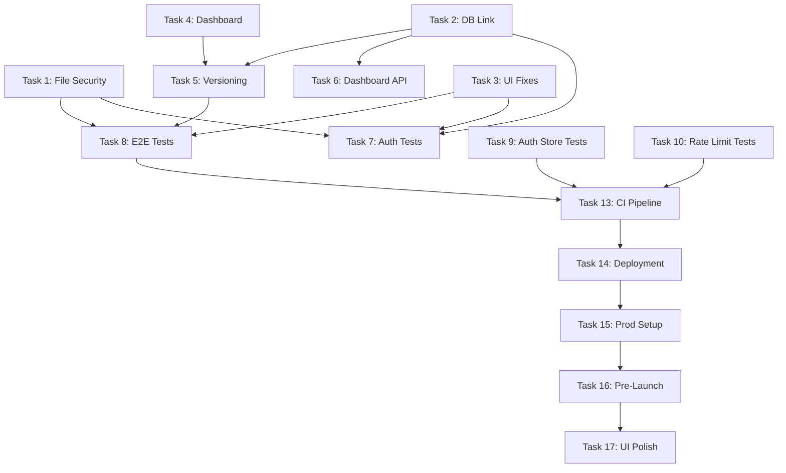

# Portfolio Builder - Sprint Documentation Package

> **Generated**: November 2025  
> **Sprint**: Current Active Sprint  
> **Status**: Ready for Implementation

---

## 👥 Team Roster

| Team Member | Role | Primary Responsibilities | Sprint Tasks |
|-------------|------|-------------------------|--------------|
| **Amir** | Team Lead & Full-Stack Developer | Architecture design, code review, technical decisions, integration oversight | All tasks oversight, final approval |
| **Israel** | Backend Developer | Core API development, business logic implementation, security patterns | Tasks 1, 2, 5, 6, 7 |
| **Ido** | Backend Developer | Database design, schema migrations, backend testing, data integrity | Tasks 1, 2, 5, 10 |
| **Yarin** | Backend Developer & DevOps Engineer | API development, CI/CD pipelines, infrastructure, deployment | Tasks 2, 6, 7, 13, 14, 15 |
| **Netanel** | Frontend Developer | UI implementation, React components, frontend testing, user experience | Tasks 3, 4, 8, 9 |
| **Morris** | Security Engineer | Security audits, penetration testing, vulnerability assessment, EMMS validation | Tasks 1, 6, 7, 16 |
| **Hezi** | Project Manager | Sprint planning, task tracking, team coordination, stakeholder communication | Sprint management, daily standups |
| **Yoad** | UI/UX Designer | Design system, user flows, wireframes, visual design, usability testing | Design support for Tasks 3, 4, 17 |

---

## 📦 What's Included

This package contains comprehensive sprint planning and implementation documentation for the Portfolio Builder project:

### 📋 Core Documents

1. **SPRINT_IMPLEMENTATION_GUIDE.md** (Part 1)
   - P0 Critical Tasks (File Security, DB Link, UI Fixes)
   - P1 Core Features (Portfolio Dashboard, Versioning, APIs)
   - Complete implementation plans with code examples
   - Testing strategies for each task

2. **SPRINT_IMPLEMENTATION_GUIDE_PART2.md** (Part 2)
   - P2 Testing Tasks (E2E, Unit Tests, Integration Tests)
   - Playwright E2E test suites
   - Vitest unit test patterns
   - Pytest integration tests
   - CI/CD integration

3. **INSTRUCTION_IMPROVEMENTS.md** (Summary & Improvements)
   - Actionable improvements to existing instruction files
   - Team coordination patterns
   - Portfolio dashboard architecture
   - Portfolio view design patterns
   - Troubleshooting guide
   - Sprint tracking methodology

---

## 🎯 Quick Start

### For Project Managers

**Priority Overview**:
```
Week 1: P0 Tasks (BLOCKING)
├─ Task 1: File Upload Security (2-3 days)
├─ Task 2: Database Resumes-Users Link (1 day)
└─ Task 3: UI Login-Registration Fixes (1 day)

Week 2: P1 & P2 Tasks
├─ Tasks 4-7: Core Features (8-10 days total)
└─ Tasks 8-12: Testing & Quality (8-10 days total)

Week 3: P3 Tasks (Infrastructure)
└─ Tasks 13-17: CI/CD, Deployment, Polish
```

**Critical Path**:
1. File Security → All upload features depend on this
2. DB Link → Versioning and Dashboard APIs depend on this
3. UI Fixes → E2E tests depend on this

### For Developers

**1. Read Instruction Files First** (30 minutes)
- `.github/instructions/copilot-instructions.md` - Master overview
- `.github/instructions/backend.instructions.md` OR `frontend.instructions.md` (your domain)
- `INSTRUCTION_IMPROVEMENTS.md` (this package) - Sprint-specific patterns

**2. Review Your Assigned Tasks** (1 hour)
- Find your tasks in `SPRINT_IMPLEMENTATION_GUIDE.md`
- Review implementation plan
- Check dependencies
- Note any blockers

**3. Setup Development Environment** (30 minutes)
```bash
# Pull latest code
git checkout dev
git pull origin dev

# Start services
docker compose up --build -d

# Verify services
docker compose ps

# Run existing tests
cd backend && pytest
cd frontend && npm test
```

**4. Create Feature Branch**
```bash
git checkout -b <role>/<your-name>/<task-name>

# Example:
git checkout -b backend/daniel/file-upload-security
```

**5. Begin Implementation**
- Follow patterns from implementation guide
- Write tests alongside code (TDD)
- Commit frequently
- Reference instruction files

### For AI Assistants (GitHub Copilot, Claude, etc.)

**Mandatory Reading Order**:
1. **This README** - Understand sprint context
2. **SPRINT_IMPLEMENTATION_GUIDE.md** - Detailed task plans
3. **Relevant instruction file** - Architecture patterns
   - Backend tasks → `backend.instructions.md`
   - Frontend tasks → `frontend.instructions.md`

**Implementation Protocol**:
1. Identify which sprint task you're implementing
2. Read the complete implementation plan for that task
3. Follow code examples exactly (adjust for context)
4. Apply security patterns (EMMS, validation, etc.)
5. Write tests matching test examples
6. Reference instruction file patterns

---

## 📊 Sprint Overview

### Sprint Goals

**Primary Goal**: Secure MVP with complete authentication, file upload, and portfolio dashboard

**Success Criteria**:
- ✅ All P0 tasks completed and tested
- ✅ File uploads validated with EMMS pattern
- ✅ Guest upload flow working with 2-minute timeout
- ✅ Portfolio dashboard functional with live preview
- ✅ >80% test coverage
- ✅ All tests passing in CI
- ✅ Production-ready security validation

### Team Assignments

| Team Member | Role | Focus Areas | Key Tasks |
|-------------|------|-------------|-----------|
| **Amir** | Team Lead & Full-Stack | Architecture, Code Review, Integration | All tasks oversight, technical decisions |
| **Israel** | Backend Developer | Core APIs, Business Logic | Tasks 1, 2, 5, 6, 7 |
| **Ido** | Backend Developer | Database, Migrations, Security | Tasks 1, 2, 5, 10 |
| **Yarin** | Backend Developer & DevOps | APIs, CI/CD, Infrastructure | Tasks 2, 6, 7, 13, 14, 15 |
| **Netanel** | Frontend Developer | UI Implementation, Testing | Tasks 3, 4, 8, 9 |
| **Morris** | Security Engineer | Security Review, Penetration Testing | Tasks 1, 6, 7, 16 |
| **Hezi** | Project Manager | Sprint Planning, Tracking, Coordination | Sprint management, stakeholder communication |
| **Yoad** | UI/UX Designer | Design System, User Flows, Mockups | Design support for Tasks 3, 4, 17 |

### Dependencies Map



---

## 🔍 Key Implementation Patterns

### EMMS Pattern (File Upload Security)

**Memory Aid**: Extension → MIME → Magic bytes → Size

```python
# Always implement in this order:
1. Verify extension (reject double extensions)
2. Verify MIME type (Content-Type header)
3. Verify magic bytes (first 8 bytes of file)
4. Verify size (streaming validation)
```

**Example**: See `SPRINT_IMPLEMENTATION_GUIDE.md` → Task 1

### TSS-D Pattern (Frontend Components)

**Memory Aid**: Think → Show → Style → Define

```
Component/
├── Component.tsx        # Think: State & logic
├── Component.view.tsx   # Show: Presentational JSX
├── Component.styles.scss # Style: BEM + design tokens
└── Component.types.ts   # Define: TypeScript interfaces
```

**Example**: See `SPRINT_IMPLEMENTATION_GUIDE.md` → Task 4

### WHDS-G Pattern (Backend Features)

**Memory Aid**: Where → Handle → Do → Shape → Guard

```
features/<feature>/
├── routes.py      # Where: URL paths
├── controller.py  # Handle: HTTP logic
├── service.py     # Do: Business logic
├── schemas.py     # Shape: Data contracts
└── security.py    # Guard: Validation
```

**Example**: See `SPRINT_IMPLEMENTATION_GUIDE.md` → Task 1

---

## 📝 Task Implementation Quick Reference

### P0: Critical Tasks (Week 1)

| Task | File Location | Time | Key Pattern |
|------|---------------|------|-------------|
| **1. File Security** | `backend/app/features/resumes/security.py` | 2-3 days | EMMS |
| **2. DB Link** | `backend/app/alembic/versions/XXX_link_resumes.py` | 1 day | CASCADE |
| **3. UI Fixes** | `frontend/src/features/Auth/` | 1 day | Form Validation |

### P1: Core Features (Week 2)

| Task | File Location | Time | Key Pattern |
|------|---------------|------|-------------|
| **4. Dashboard** | `frontend/src/features/Dashboard/` | 3-4 days | TSS-D + Zustand |
| **5. Versioning** | `backend/app/features/portfolios/version_service.py` | 2 days | JSONB Snapshots |
| **6. Dashboard API** | `backend/app/features/portfolios/controller.py` | 2 days | WHDS-G |
| **7. Auth Tests** | `backend/app/tests/features/test_auth.py` | 2 days | Pytest Async |

### P2: Testing (Week 2)

| Task | File Location | Time | Key Pattern |
|------|---------------|------|-------------|
| **8. E2E Tests** | `frontend/tests/e2e/*.spec.ts` | 3-4 days | Playwright |
| **9. Auth Store Tests** | `frontend/src/tests/unit/authStore.test.ts` | 1 day | Vitest + Mock |
| **10. Rate Limit Tests** | `backend/app/tests/features/test_rate_limiting.py` | 1 day | Pytest Async |

---

## 🚀 Getting Started Today

### Morning (First 2 Hours)

**1. Environment Setup** (30 min)
```bash
# Pull latest
git checkout dev && git pull

# Start services
docker compose up --build -d

# Verify
docker compose ps
docker compose logs -f backend frontend
```

**2. Read Documentation** (60 min)
- [ ] Read this README
- [ ] Read your assigned task in implementation guide
- [ ] Review relevant patterns in instruction files
- [ ] Check for dependencies and blockers

**3. Team Sync** (30 min)
- [ ] Review sprint board
- [ ] Confirm priorities
- [ ] Note any questions/blockers
- [ ] Coordinate with dependent tasks

### First Task (Next 6 Hours)

**Backend (Israel, Ido, Yarin): Task 1 - File Security**
1. Create `backend/app/features/resumes/security.py`
2. Implement EMMS validation functions
3. Write unit tests (15+ test cases)
4. Integrate with upload controller
5. Test manually with various file types
6. Create PR with detailed description

**Frontend (Netanel): Task 3 - UI Fixes**
1. Fix upload screen routing
2. Implement guest upload state management
3. Add auth prompt modal
4. Fix password validation (12 char minimum)
5. Fix error message styling
6. Test complete flow manually
7. Create PR with screenshots

**DevOps (Yarin): Task 13 - CI Setup**
1. Review existing GitHub Actions
2. Add backend test job
3. Add frontend test job
4. Add E2E test job (once available)
5. Configure coverage reporting
6. Test PR workflow
7. Document CI process

---

## 📚 Documentation Structure

### Primary Guides

```
Portfolio Builder Instructions
│
├── Existing (Read First)
│   ├── copilot-instructions.md         ← Master overview
│   ├── ARCHITECTURE.md                 ← System design
│   ├── backend.instructions.md         ← Backend patterns
│   ├── frontend.instructions.md        ← Frontend patterns
│   └── DEVELOPMENT_GUIDE.md            ← Quick reference
│
└── Sprint Guides (This Package)
    ├── SPRINT_IMPLEMENTATION_GUIDE.md      ← P0 & P1 tasks
    ├── SPRINT_IMPLEMENTATION_GUIDE_PART2.md ← P2 testing tasks
    └── INSTRUCTION_IMPROVEMENTS.md          ← Improvements & summary
```

### How to Use

**Before any task**:
1. Read relevant existing instruction file (architecture/patterns)
2. Read sprint implementation guide for your task
3. Follow code examples exactly
4. Reference patterns consistently

**During implementation**:
1. Keep instruction files open for reference
2. Apply patterns from examples
3. Write tests matching test examples
4. Commit with meaningful messages referencing patterns

**Code review**:
1. Check against instruction file patterns
2. Verify tests cover edge cases
3. Ensure documentation updated
4. Reference specific instruction file sections in review

---

## 🎯 Success Metrics

### Sprint Velocity

**Target**: 20 story points/week  
**Measurement**: Track completed tasks vs estimated

### Code Quality

| Metric | Target | How to Check |
|--------|--------|--------------|
| **Test Coverage** | >80% | `pytest --cov` (backend), `npm run test:coverage` (frontend) |
| **Linting** | Zero warnings | `ruff check .` (backend), `npm run lint` (frontend) |
| **Type Safety** | Zero errors | `mypy .` (backend), `tsc --noEmit` (frontend) |

### Deployment Readiness

- [ ] All P0 and P1 tasks complete
- [ ] All tests passing in CI
- [ ] Security review completed
- [ ] Documentation updated
- [ ] Demo prepared for stakeholders

---

## ❓ Common Questions

### "Where do I start?"

1. Read this README (you're doing it!)
2. Review your assigned tasks in implementation guide
3. Setup development environment
4. Start with your first P0 task

### "What if I'm blocked?"

1. Check dependencies - is a prerequisite task incomplete?
2. Ask in `#blockers` Slack channel immediately
3. Document the blocker in GitHub issue
4. Work on a parallel task if possible
5. Escalate if blocked >4 hours

### "How do I know I'm following patterns correctly?"

1. Compare your code to examples in implementation guide
2. Check instruction files for pattern definitions
3. Request early code review (draft PR)
4. Use AI assistant to validate against patterns

### "What if tests are failing?"

1. Run tests locally first: `pytest -v` or `npm test`
2. Check test fixtures and mocks
3. Verify database state is clean
4. Look at CI logs for environment differences
5. Ask for help in `#dev` if stuck >1 hour

---

## 📞 Support & Resources

### Communication Channels

- **Slack #dev** - General development questions
- **Slack #blockers** - Urgent blockers needing attention
- **GitHub Issues** - Bug reports, feature discussions
- **GitHub PRs** - Code review, implementation details

### Key Contacts

- **Backend Lead**: Israel, Ido, Yarin - File security, database, APIs
- **Frontend Lead**: Netanel - UI/UX, dashboard, testing
- **DevOps Lead**: Yarin - CI/CD, infrastructure, deployment
- **Security (Morris)** - Security reviews, penetration testing

### External Resources

- **OWASP Top 10**: https://owasp.org/www-project-top-ten/
- **FastAPI Docs**: https://fastapi.tiangolo.com/
- **React Testing**: https://testing-library.com/
- **Playwright**: https://playwright.dev/
- **PostgreSQL**: https://www.postgresql.org/docs/

---

## 🎉 Sprint Kickoff Checklist

### Team Setup

- [ ] All developers have access to repository
- [ ] All developers can run `docker compose up` successfully
- [ ] Sprint board created with all tasks
- [ ] Task assignments confirmed
- [ ] Dependencies mapped and understood

### Documentation Review

- [ ] Team read this README
- [ ] Team reviewed sprint implementation guides
- [ ] Team understands priority system (P0, P1, P2, P3)
- [ ] Team familiar with patterns (EMMS, TSS-D, WHDS-G)

### Environment Verification

- [ ] All services start successfully
- [ ] Database migrations run
- [ ] Existing tests pass
- [ ] Development credentials configured

### First Day Goals

- [ ] Everyone completes environment setup
- [ ] Everyone starts assigned P0 task
- [ ] First commits pushed to feature branches
- [ ] No blockers reported

---

## 🏁 Next Steps

**Today**:
1. ✅ Read this README completely
2. ✅ Setup development environment
3. ✅ Read your task in implementation guide
4. ✅ Start implementation following patterns

**This Week**:
1. ✅ Complete assigned P0 tasks
2. ✅ Write comprehensive tests
3. ✅ Submit PRs with detailed descriptions
4. ✅ Begin P1 tasks

**Next Week**:
1. ✅ Complete P1 and P2 tasks
2. ✅ Ensure >80% test coverage
3. ✅ Begin P3 deployment tasks
4. ✅ Prepare sprint demo

---

## 📄 Document Versions

- **SPRINT_IMPLEMENTATION_GUIDE.md**: v1.0 (P0, P1 tasks)
- **SPRINT_IMPLEMENTATION_GUIDE_PART2.md**: v1.0 (P2 testing tasks)
- **INSTRUCTION_IMPROVEMENTS.md**: v1.0 (Improvements & patterns)
- **README.md** (this file): v1.0

---

**Last Updated**: November 2025  
**Sprint Duration**: 3 weeks  
**Team**: Backend (Israel, Ido, Yarin), Frontend (Netanel), DevOps (Yarin)

**Feedback**: Open PR to `.github/instructions/` with suggested improvements

---

## 🌟 Remember

> "Good code is its own documentation. Great code follows documented patterns."

- **Always read instruction files before coding**
- **Follow established patterns exactly**
- **Write tests alongside code**
- **Communicate blockers immediately**
- **Review code against instruction files**

**Let's build something amazing! 🚀**
